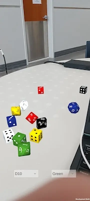

# AR Dice
This is a Unity AR mobile application that lets you throw virtual dice on your own tabletop!

First, the user should aim the camera at a surface and wait for it to be detected by the app.

* Double tap to spawn a new die
* Grab it with your finger. Swipe up and release to throw
* You can also choose a 6-sided or 10-sided die, and it's color
* Shaking the phone will rumble all the dice
* You can pick up and move or re-throw existing dice as needed

I made this app because I wanted to try using Unity's augmented reality features, and see what it was like building for mobile. I built it for Android, but it can easily be built for Apple phones as well, since Unity provides both options.

[Video Demonstration](https://youtu.be/VCDjHUKEJ84) - 7/1/2023

# Development Environment

I used Unity to build this app, and started with the AR Core template. This creates a new project with all the main components and project settings needed to develop augmented reality apps.

# Useful Sources for Unity AR

* [Unity AR Foundation Documentation](https://docs.unity3d.com/Packages/com.unity.xr.arfoundation@5.0/manual/index.html)
* [YouTube: AR Foundation in Unity - Beginner Friendly Tutorial](https://youtu.be/FWyTf3USDCQ) by samyam

# Future Work

* Add an option to quickly remove all dice (besides throwing them into the abyss)
* Improve throwing physics/velocity calculation
* Add an option to choose a collection of dice to throw all at once
* Save preset dice collections to throw later